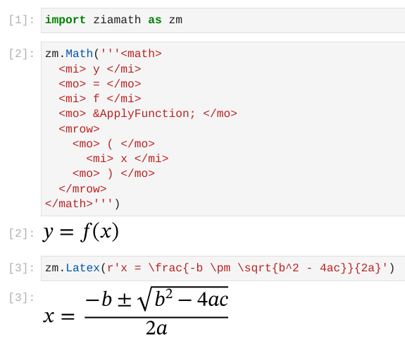

# ziamath

Render MathML or LaTeX Math expressions as SVG. Does not require a Latex installation.

Ziamath comes with the STIXTwoMath-Regular font installed for use by default.
Other Math-enabled Open Type fonts (TTF or OTF files) may also be used.

Documentation is available at [readthedocs](https://ziamath.readthedocs.io)
